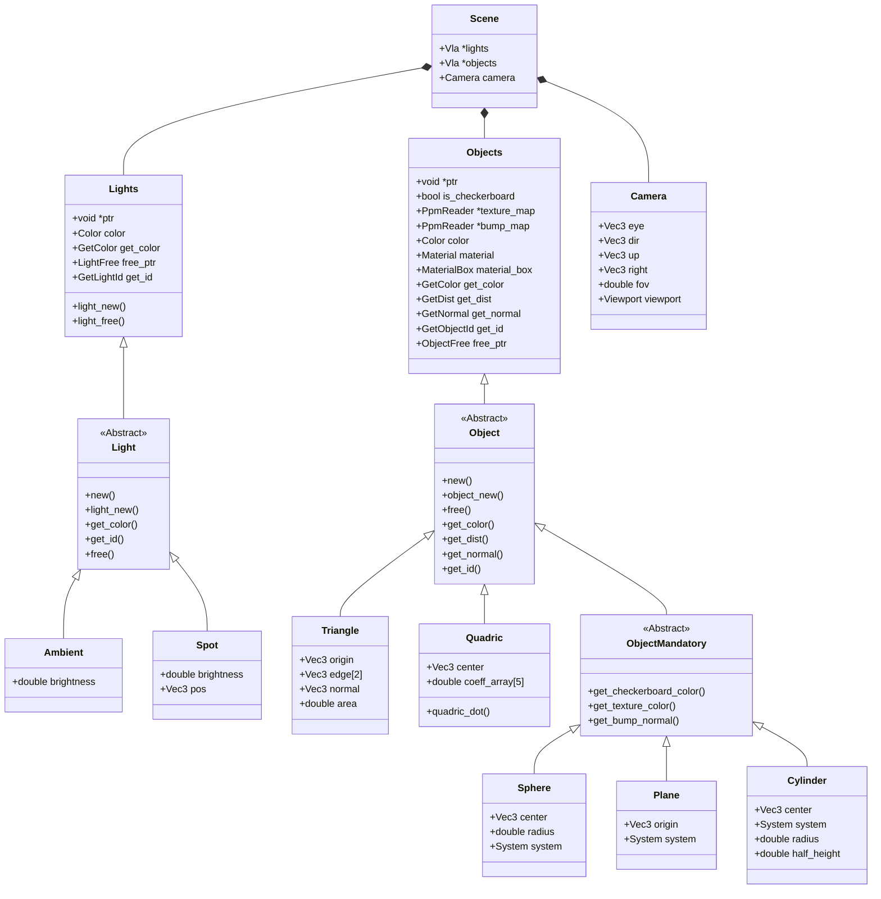

```mermaid
classDiagram

SCENE *-- LIGHTS
SCENE *-- OBJECTS
SCENE *-- CAMERA

LIGHTS <|-- ABS_LIGHT
ABS_LIGHT <|-- A
ABS_LIGHT <|-- L

OBJECTS <|-- ABS_OBJECT
ABS_OBJECT <|-- tr
ABS_OBJECT <|-- qd
ABS_OBJECT <|-- ABS_OBJECT_MANDATORY
ABS_OBJECT_MANDATORY <|-- sp
ABS_OBJECT_MANDATORY <|-- pl
ABS_OBJECT_MANDATORY <|-- cy

class SCENE["Scene"] {
    +Vla             *lights
    +Vla             *objects
    +Camera          camera
}

class CAMERA["Camera"] {
    +Vec3           eye
    +Vec3           dir
    +Vec3           up
    +Vec3           right
    +double         fov
    +Viewport       viewport
}

class LIGHTS["Lights"] {
    +void           *ptr
    +Color          color
    +GetColor       get_color
    +LightFree      free_ptr
    +GetLightId     get_id

    +light_new()
    +light_free()
}

class ABS_LIGHT["Light"] {
    <<Abstract>>

    +new()
    +light_new()
    +get_color()
    +get_id()
    +free()
}

class A["Ambient"] {
    +double         brightness
}

class L["Spot"] {
    +double         brightness
    +Vec3           pos
}

class OBJECTS["Objects"] {
    +void           *ptr
    +bool           is_checkerboard
    +PpmReader      *texture_map
    +PpmReader      *bump_map
    +Color          color
    +Material       material
    +MaterialBox    material_box
    +GetColor       get_color
    +GetDist        get_dist
    +GetNormal      get_normal
    +GetObjectId    get_id
    +ObjectFree     free_ptr
}

class ABS_OBJECT["Object"] {
    <<Abstract>>
    +new()
    +object_new()
    +free()
    +get_color()
    +get_dist()
    +get_normal()
    +get_id()
}

class ABS_OBJECT_MANDATORY["ObjectMandatory"] {
    <<Abstract>>
    +get_checkerboard_color()
    +get_texture_color()
    +get_bump_normal()
}

class sp["Sphere"] {
    +Vec3           center
    +double         radius
    +System         system
}

class pl["Plane"] {
    +Vec3           origin
    +System         system
}

class cy["Cylinder"] {
    +Vec3           center
    +System         system
    +double         radius
    +double         half_height
}

class tr["Triangle"] {
    +Vec3           origin
    +Vec3           edge[2]
    +Vec3           normal
    +double         area
}

class qd["Quadric"] {
    +Vec3           center
    +double         coeff_array[5]

    +quadric_dot()
}


```
